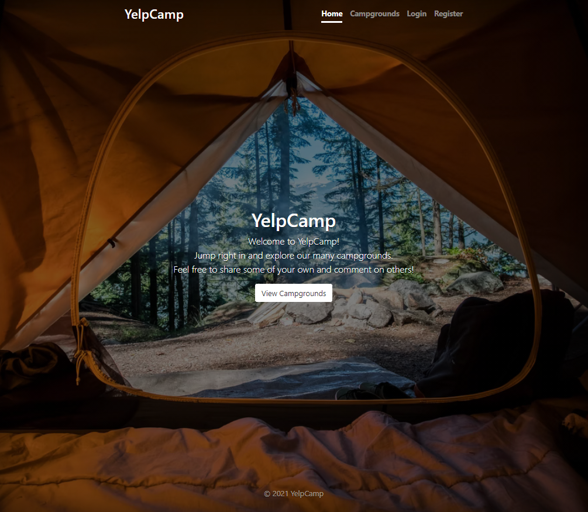
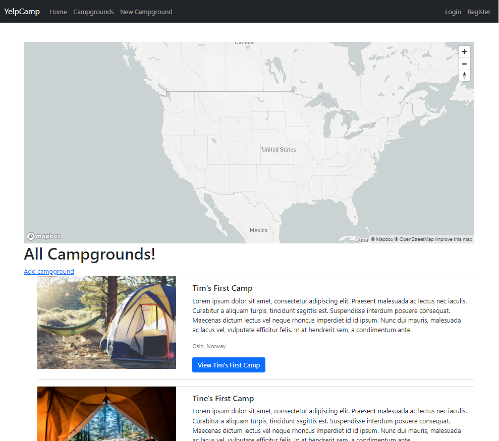
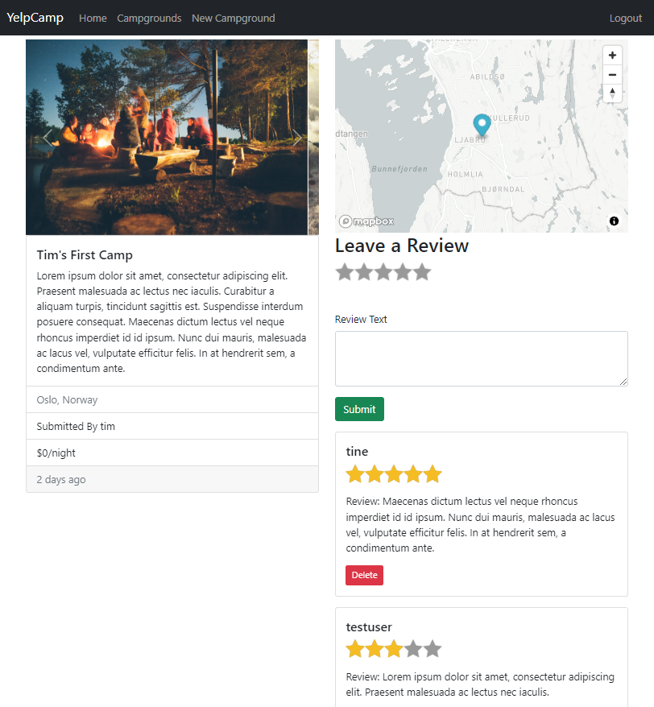

# YelpCamp
This is a Fullstack website developed in connection with the Udemy Course [The Web Developer Bootcamp 2021](https://www.udemy.com/course/the-web-developer-bootcamp/) created by Colt Steele.

The completed web app is deployed using Heroku and can be found [here](https://limitless-beyond-02363.herokuapp.com/).

## Project Description
YelpCamp is a website for sharing and reviewing campgrounds. Users have to be logged in to be allowed to post a campground or review. Only the user who has posted the campground or review is able to edit or delete it. Users can leave a review on a campground made by another user.

 

## Technical details
The main languages, tools and packages used is listed here:
* HTML, CSS ([Bootstrap v5](https://getbootstrap.com/docs/5.0/getting-started/introduction/)), JavaScript
* [Node JS](https://nodejs.org/en/), [Express](https://expressjs.com/)
* [EJS Templating engine](https://ejs.co/)
* [MongoDB](https://www.mongodb.com/) and [Mongoose ODM](https://mongoosejs.com/)
* [Cloudinary](https://cloudinary.com/) - used to store images from campgrounds
* [Passport](http://www.passportjs.org/) - used for authentication
* [Mapbox](https://www.mapbox.com/)
* [Heroku](https://www.heroku.com/)

    
